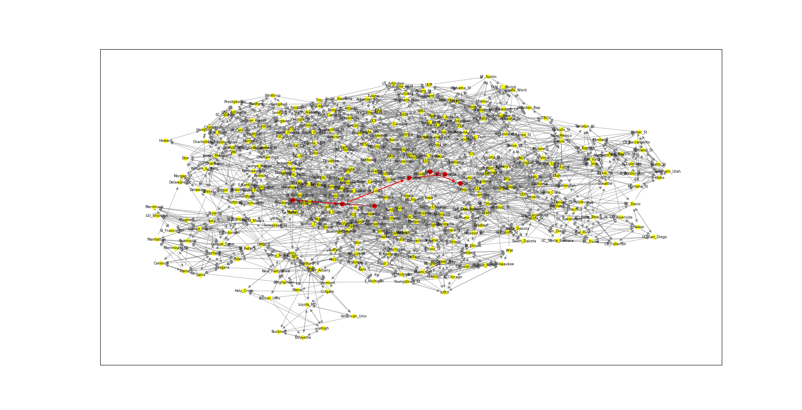

# CS 225 Final Project 

## Mark Bauer, Jack Joshi, Jacob Tentis

### Overview

The goal of this project was to create a tool using BFS, IDDFS, and Djikstra's algorithm in order to view and analyze the relative wins and losses of D1 Men's Basketball teams within the NCAA. The internal framework for this project maps teams in the NCAA to a graph, with edges between nodes correspending to one team beating another (i.e. the node for the winner will have an edge pointing to the loser). Our code runs by accepting the name of a start team and an end team, and based on the relative wins and losses of each team, identifies the shortest path to get from the start team to the end team (a visualization can also be produced if the user has the proper libraries installed, although this is not necessary for the code to execute properly). Post execution, every single edge within the given dataset and the shortest path between the two selected teams are outputted to a text file.

### Control Flow

Control flow for our program begins in main.cpp with the declaration of a Graph object, taking in as parameters csv files for game data and all of the teams within the NCAA. We opted to use an adjacency list implementation for our graph, as we believe it is the most logical and straightforward implementation. From here, our program reads the inputted files in order to populate the newly created graph with each team and node, and then the resulting nodes are outputted to a text file. At this point, the user has the option of either using BFS on their graph to produce a traversal, using IDDFS to see if one node can be reached from another in a given number of steps, or using Dijkstra's algorithm to identify the shortest path between their nodes. If the user calls BFS, a traversal will be produced and control flow will end. If the user calls IDDFS, the program will identify if a path between two teams can be created in a fewer than a given number of steps. If the user calls Dijkstra's algorithm, the program will identify the shortest path between two teams that the user inputs, and the resulting path will be printed from a text file. Finally, if the user has python and the library networkx installed on their computer, they can run an optional visualization program that will display an image of the entire graph, including a highlighted path between their two selected teams. For example, here is a visualization of the path from Illinois to Gonzaga.

### Discoveries

One discovery that we made is that every team (besides Chicago State) has a shortest path to beating Illinois and that Illinois has a shortest path to beating every other team. This means that there must exist a cycle of teams beating teams such that every team is included (what is known as a “circle of suck”). The testing behind this theory can be found in the `tests/test_dijkstra.cpp` file in the `"Almost all or all teams (besides Chicago_St) should have a path to beating Illinois"` and `"Illinois should have a path to beating almost all or all teams"` test cases (which are commented out due to runtime).

Another discovery we made refers to the visualization of the data. When visualizing the graph, we found that nodes were clumped together in areas that roughly reflected individual conferences (this can be seen in `path.png`). This makes sense because the majority of games that a specific team plays are against teams from their own conference.

One more discovery that we made is that IDDFS performs very poorly on a large dataset because it incorporates DFS and with the iterative use of DFS, a lot of time is required for a dataset this large.

### Conclusions

One of our proposed goals was to find the shortest path linking team A to team B based on the teams that team A had beaten and the teams that those teams have beaten and so on until we reach a team that has beaten team B. This goal was achieved by setting up the graph structure and Dijkstra’s algorithm (see `dijkstra.cpp`), which finds the shortest path between team A and team B.

Another one of our proposed goals was to determine if there exists a “circle of suck” such that there is a cycle consisting of teams beating teams where every team is included. We determined that this can be achieved (when excluding Chicago State) and more details are described in the above section (“Discoveries”).

To prove that BFS, IDDFS, and Dijkstra’s are working correctly, we wrote unit tests that can be found in `tests/test_BFS.cpp`, `tests/test_IDDFS.cpp`, and `tests/test_dijkstra.cpp`. For BFS, we ensure that a proper breadth-first check is performed by checking that the correct team is on top, the ordering is maintained, the iterator starts at the correct team, and the BFS visits all of the teams in the correct order (checked fully on the sample data). For IDDFS, we ensure that a proper IDDFS is performed by checking if a node can be reached in a given number of steps, that nodes are visited in the proper order, and that the underlying DFS used within IDDFS is implemented correctly. For Dijkstra’s, we ensure that the shortest path algorithm is properly implemented by checking that true outcomes are reflected by a shortest path length of 1, that Chicago_St (which did not win any games) has no path to beating any team, and that the shortest path is chosen by choosing the team that comes first (based on sorted order) or by choosing the path that contains the least number of teams. For example, the shortest path from Illinois to Michigan should be exactly that because Illinois beat Michigan directly.

### Improvements

One improvement we would have liked to make with more time is the implementation of a full cycle algorithm to fully print out a "circle of suck." Additionally, we would've like to have implemented a better way for visualizing our data that could run directly through C++ with no extensions. Finally, with more time, we feel it would have been interesting to display the graph visualization as an interactive display on a website. This would make the shortest path visualization more user-friendly and more dynamic in general.

